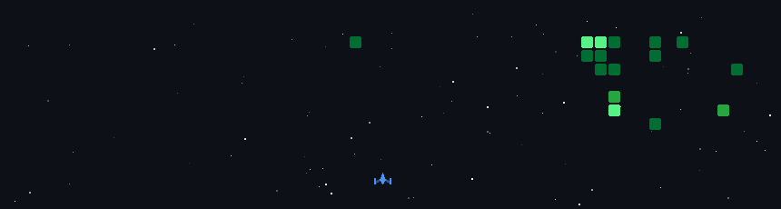

  

<h2>💫 About Me:</h2> Hey, I'm Taniya Halder 👋 I'm a first-year BS in Data Science student at IIT Madras, currently juggling AI/ML 🤖, mern‑stack web dev 💻, and cybersecurity 🔐. I like breaking things to understand them, then rebuilding them cleaner 🏗️. If you see messy repos here, that's just work-in-progress brain dumps 🧠, not abandoned dreams (hopefully) 🤞

## 🌐 Socials:

 
  
  
  

# 💻 Tech Stack:
<h3 align="left">Languages and Tools:</h3>

<!--  -->
<!--  -->

## 📊 Github Stats:

  
  
  
  
   
  

### ✍️ Random Dev Quote
---

### 🔝 Top Contributed Repo
---

# ■ My GitHub Activity Game

 

