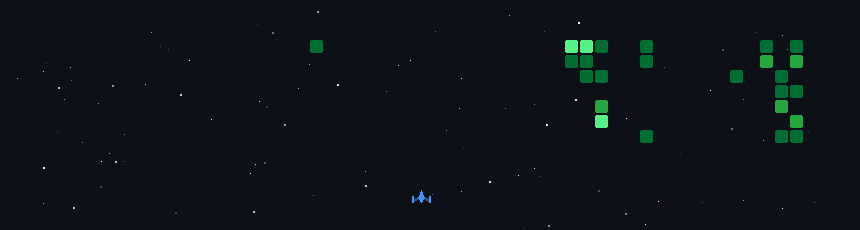

  

<h2>💫 About Me:</h2> Hey, I'm Taniya Halder 👋 I'm a first-year BS in Data Science student at IIT Madras, currently  exploring Tech, Data & Innovation 💻. I like breaking things to understand them, then rebuilding them cleaner 🏗️. If you see messy repos here, that's just work-in-progress brain dumps 🧠, not abandoned dreams (hopefully) 🤞

## 🌐 Socials:
  
  
  
  <a href="https://leetcode.com/u/Taniya_h/" target="_blank" rel="noreferrer">
    

# 💻 Tech Stack:
**Programming Languages**
 

**Frontend Development**
 

**Backend Development**
 

**Databases**
 

**Data Science & Machine Learning**
 

## 📊 Github Stats:

  
  
  
  
   
  

### ✍️ Random Dev Quote
---

### 🔝 Top Contributed Repo
---

# ■ My GitHub Activity Game

 

