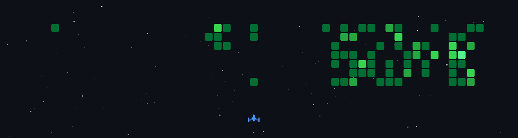

  

  
  
  
  

# ୨୧ ⋆｡°✩ 𓂃 ࣪˖ ִֶָ☾. ⋆｡°✩ ୨୧

୨୧ ────────────────────── ୨୧

 

<table>
  <tr>
    <td align="left" align="middle">
        
    </td>
    <td align="right" valign="middle">
      
    </td>
  </tr>
</table>
  

୨୧ ────────────── ୨୧

꒰ა ♡ ໒꒱

## ୨୧ ⋆｡°✩ About Me ✩°｡⋆

Heyyy! I'm **Taniya** 👋🏻🎀

I'm a first-year **BS in Data Science student at IIT Madras**, currently learning **whatever interesting tech rabbit hole I fall into next**. 

  
### ꒰ა ♡ ໒꒱ Currently I'm:

୨୧ Learning things I probably should've started learning three months ago. 🎀 
୨୧ Building random little projects because tutorials get boring. 🎀 
୨୧ Trying to convince my code to work on the first try make the damn code run. 🎀  

⋆｡°✩ ───────────── ✩°｡⋆

꒰ა ♡ ໒꒱

## ୨୧ ⋆｡°✩ My Tech Stack ✩°｡⋆

### ₊˚⊹♡ Languages ♡⊹˚₊

 

### ₊˚⊹♡ Frontend ♡⊹˚₊

 

### ₊˚⊹♡ Backend ♡⊹˚₊

 

### ₊˚⊹♡ Databases ♡⊹˚₊

 

### ₊˚⊹♡ Data Science & ML ♡⊹˚₊

 

### ₊˚⊹♡ AI & Agents ♡⊹˚₊

 

### ₊˚⊹♡ Tools ♡⊹˚₊

 

୨୧ ────────────── ୨୧

꒰ა ♡ ໒꒱

## ୨୧ ⋆｡°✩ GitHub Stats ✩°｡⋆

 

 

 

 

୨୧ ────────────── ୨୧

꒰ა ♡ ໒꒱

## ୨୧ ⋆｡°✩ GitHub Activity ✩°｡⋆

୨୧ ────────────── ୨୧

୨୧ ⋆｡°✩ 𓂃 ࣪˖ ִֶָ☾. ⋆｡°✩ ୨୧

**Thanks for stopping by! 🎀**

*Now go look at my repositories. you might find something mildly interesting.*

# ୨୧ ⋆｡°✩ 𓂃 ࣪˖ ִֶָ☾. ⋆｡°✩ ୨୧

୨୧ ────────────────────── ୨୧

